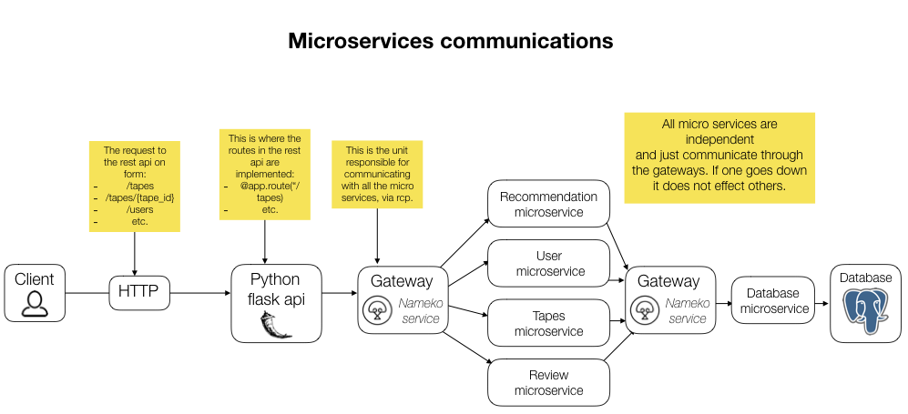

# Project 2, Videotapes Galore, a Rest API
**Authors:** Benedikt Óskarsson and Benedikt Þorri Þórarinsson

## Project design

The project is designed using the microservices design pattern, where each service is separate standalone application that communicates with other services to get relevant results.

### Tools used

To be able to do a microservices application that is close to a real production microservices application various tools other than the programming language and database where needed to be able to let the services run as unit nad communicate with each other.

* **Python:**
All services in the application are implemented with Python.

* **Python flask:**
The Rest API is implemented withPython flask

* **Postgres SQL:**
The database is a Postgres SQL relational database.

* **Docker:** 
Docker is a program tha performs operating-system-level virtualization where each service is packed into a container and docker starts up each service and collects their dependencies, with required config in docker-compose files and Dockerfiles.  Docker should be the only install requirement to be able to run this project locally.   
[Installation guide for docker here](https://docs.docker.com/install/#general-availability) 

* **Nameko and Rabbit server:** 
Nameko is framework for building microservices is python and handles all communications between the services with asynchronous events, 
using rpc over Advanced Message Queuing Protocol (AMQP) is a network protocol that has less overhead then *http* for example and is made to handle asynchronous events. The Rabbit server is used with nameko and functions as an event distributor for the message queuing.

* **Pytest:** Pytest testing framework is used to handle all testing in the Application.

### Services

Each service has an nameko api class with functions that other services can communicated *(functions marked with **rpc**)*. The api then calls relevant procedures from each service. It's worth mentioning that each service is completely independent and if one service goes down the others can function completely normal (given that they don't depend on calling the service that goes down, for example most services need to use database service to complete requests). 

* **Rest API Service:**  
This service is  equivalent to a the top layer in standard three-tier architecture, this is where the *get, post, put and delete request* are received appropriate services called.

* **User Service:**  
This service does any validation needed to process user requests and the calls the relevant method in the database service. 

* **Tapes Service:**  
Similarly to the user service the tape services does validation and then uses the database service to complete the requests.

* **Review Service:**  
Handles validation of reviews and then communicates with the database service.

* **Recommendation Service:**  
Gets recommendation for the user based on highest average rating on tapes that the given user has not seen.


This picture illustrates further how the services are set up and how they communicate:




### Running the Project

After installing docker the project can be run with this command:
```console
 docker-compose build && docker-compose up
```

When all services have been started and the Application is ready to process requests it can be used with *Postman, Curl or other http request application*.

**Problems:**  
If you encounter any problems with docker containers or database, docker can be reset with and then the project started again:
```console
./reset_docker.sh
```
Note that this will also reset the database to the original starting state with the initial data (from the json files).

### Directory structure

As can be seen in the directory tree below each service has it's own folder (ending with service) but they share some entity classes and utilities that are copied into each container when they start up.

```console
P2
├── API.yaml
├── README.md
├── config.yml
├── database_service
│   ├── Dockerfile
│   ├── database_nameko_api.py
│   ├── database_utils.py
│   ├── db-config.json
│   ├── db_service.py
│   ├── db_tape_service.py
│   ├── db_user_service.py
│   ├── json_service.py
│   ├── requirements.txt
│   ├── tables.py
│   └── tests
│       └── db-config-test.json
├── docker-compose.test.yml
├── docker-compose.testrunner.yml
├── docker-compose.yml
├── entity_classes
│   ├── borrow.py
│   ├── tape.py
│   └── user.py
├── files
│   ├── SC-T-302-HONN_2018_Friends.json
│   └── SC-T-302-HONN_2018_Videotapes.json
├── microservices.png
├── recommendation_service
│   ├── Dockerfile
│   ├── recommendation_nameko_api.py
│   └── requirements.txt
├── reset_docker.sh
├── rest_api_service
│   ├── Dockerfile
│   ├── app.py
│   ├── recommendation_api.py
│   ├── requirements.txt
│   ├── tape_api.py
│   ├── tape_review_api.py
│   ├── user_api.py
│   ├── user_review_api.py
│   └── user_tape_api.py
├── review_service
│   ├── Dockerfile
│   ├── requirements.txt
│   ├── review_nameko_api.py
│   └── review_service_file.py
├── shared_utils
│   ├── config.py
│   ├── logger.py
│   ├── requirements.txt
│   └── run-nameko.sh
├── tape_service
│   ├── Dockerfile
│   ├── requirements.txt
│   ├── tape_nameko_api.py
│   └── tape_service_file.py
├── tests
│   ├── Dockerfile
│   ├── requirements.txt
│   ├── run-tests.sh
│   ├── test_recommendation.py
│   ├── test_reviews.py
│   ├── test_tape.py
│   ├── test_user.py
│   └── test_user_tape.py
└── user_service
    ├── Dockerfile
    ├── requirements.txt
    ├── user_nameko_api.py
    └── user_service_file.py
```

## Testing

Because this project is implemented with microservices where each service has very little purpose on it's own we decided that integration tests that test the whole system would serve a lot more purpose than unit testing each service.

The system has 68 different integration tests where all services and routes are tested and the system is tested as a unit. The tests use a special test database so they don't share the database with the main system. 

**Running the tests**  
To run the test first a test server is started:
```console
 docker-compose -f docker-compose.test.yml build && docker-compose -f docker-compose.test.yml up
```
After the server is up and ready the tests can be run with:
```console
 docker-compose -f docker-compose.testrunner.yml  build && docker-compose -f docker-compose.testrunner.yml  up
```

Note: Before each test everything is deleted from the database and the database re-initialized.

## What we l